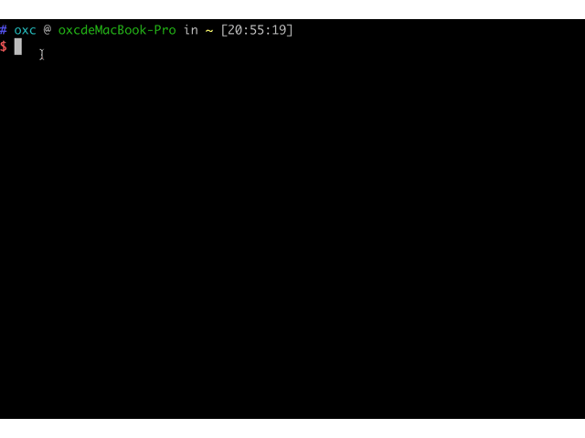

# 123

oxctp 是一个适用简单并且可以快速构建 react+typescript 的脚手架,适用于 macOS, Windows, 和 Linux 系统。

如果适用或者有建议话, 欢迎适用[issue](https://github.com/hungeroxc/oxctpl/issues)

适用方式:

```sh
npm install -g oxctpl
oxctpl init 项目名称
cd 项目名称
npm install
```



[模板地址](https://github.com/hungeroxc/oxc-tpl)
